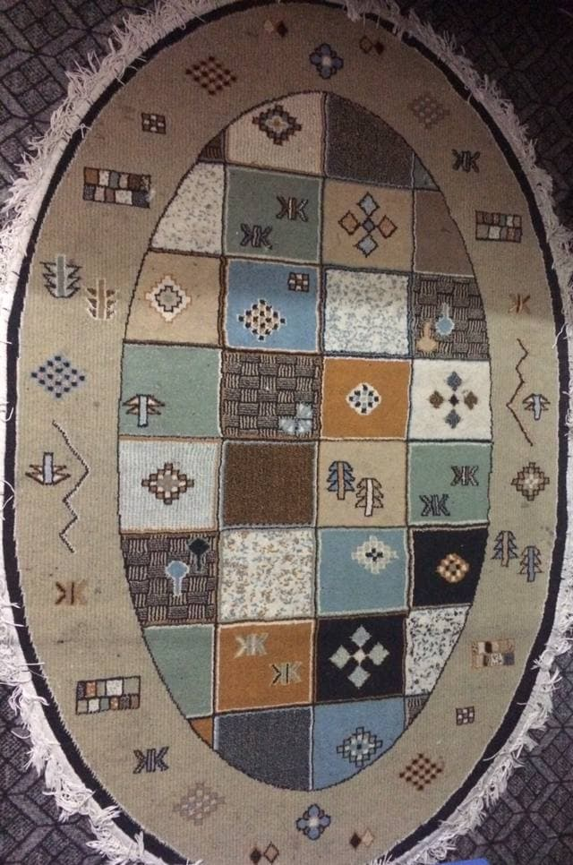

# Among Stars - Inspired by old-school arcade games and my room's persian carpet

If you look closely you can find the enemies.

## Contributing

Don't get confused with all branches. They're just how the project *could* continue.

But there's *'curses-class'* branch which is a work in progress, and what I plan to do is to encapsulate all the functions that have something to do with `ncurses` in a neat object (class).

## How to play

### Command Line Arguments

`--no-menu` Go directly to the game (without showing menu)
`--no-damage`   Die hard - cheat (technically it sets the player health to maximum possible value see [here](https://en.cppreference.com/w/cpp/types/numeric_limits/max))

## Technical Details

### Editor

The "built-in editor" is used to show useful information about the game. It processes a compile-time string_view and puts appropriate number of words based on current line length, and how much space *the description window has*. The following flags are supported by the editor (note that all the flags should appear in pairs):

* \b - tries to put the in-between text in one line. If the length exceeds maximum line length, an exception is thrown
* \* - **bold the text**
* \*\* - *make the text italic*
* \*\*\* - ***bold and italic***

Note that combining of bolding and italic between two pairs is not supported (e.g. \*testing \*\*with\*\* combination\*)
