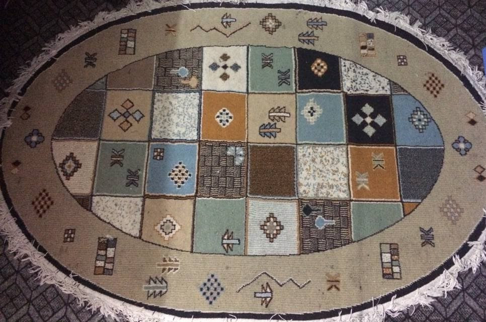

# Among Stars - Inspired by old-school arcade games and my room's persian carpet



If you look closely you can find the enemies.

## How to play

You can move around and submit/shoot with `arrow keys` and `enter` respectively.

There's also a `Help` button in the menu which explains the game.

### Command Line Arguments

`--no-menu` Go directly to the game (without showing menu)

`--no-damage`   Die hard - sets the player health to [maximum possible value](https://en.cppreference.com/w/cpp/types/numeric_limits/max)

### Score & Health

Player's stats is shown on the top-right corner:

```txt
HP: x
KP: x
```

Short for 'Health Point' and 'Kill Point'

## Compiling

There's no need to install the game you can just compile and play it locally, just make sure that you have ncurses library installed, (You also need development packages for header files).

There's tutorials on the internet on how to do it. On Debian (bullseye) you need `libncurses-dev`, `libncurses6`. This is mostly the same on other Debian derivatives like Ubuntu but let me know if there's anything different.

After that you only need to compile the program with:

`make`

then you can run the executable with `make run` or `./among_stars`

## Project's Details

You can look through [wikis](https://github.com/etzl/among-stars/wiki) for technical details, and more detailed description, which is a work in progress.

## Contributing

Don't get confused with all branches. They're just how the project *could* continue.

But there's *'curses-class'* branch which is a work in progress, and what I plan to do is to encapsulate all the functions that have something to do with `ncurses` in a neat object.
